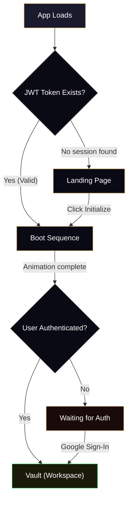
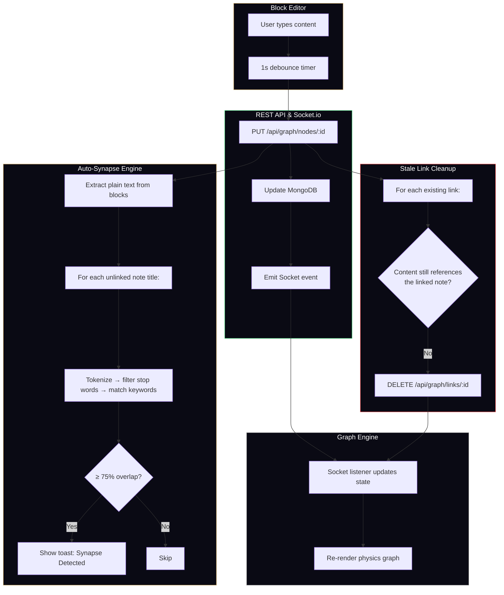
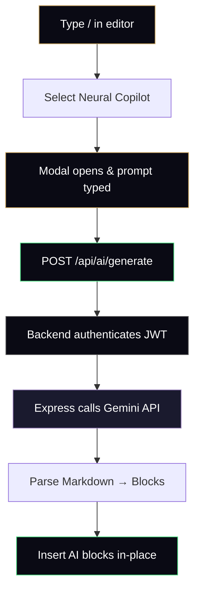

<div align="center">
  <h1> 2ndBrain (MERN Edition)</h1>
  <p><b>Architect the architecture of your mind.</b></p>
  
  [](#)
  [](#)
  [](#)
  [](#)
  [](#)
  [](#)
  
  <br />
</div>

> **2ndBrain** is a note-taking app that turns your scattered ideas into a living, connected knowledge graph — think Notion meets Obsidian, with a dark cyberpunk aesthetic.
> 
> *This is the **MERN Stack Edition**, migrating the original Firebase architecture to a custom Express/MongoDB backend with JWT authentication and Socket.io real-time synchronization.*

Instead of burying notes in folders, you link them together. The app visualizes those links as an interactive graph, suggests new connections using NLP, and even has an AI writing assistant built right into the editor. Everything syncs to the cloud in real time, and there's a leveling system that rewards you for connecting ideas.

---

## 🚀 What's New in the MERN Edition

* **🔌 Socket.io Real-Time Sync** — Replaced Firebase `onSnapshot` with bi-directional WebSockets. As you type, changes are instantly broadcasted to all your active sessions via encrypted socket rooms.
* **🔒 Secure JWT Auth** — Dropped Firebase Auth for a custom JWT-based authentication system using `@react-oauth/google`, granting complete ownership over the user database.
* **🛡️ Server-Side AI Proxy** — The Gemini API key is no longer exposed on the frontend. AI requests are now securely proxied through the Express backend `/api/ai/generate`.
* **✨ AI Writing Assistant** — Type `/` in the editor and select "Neural Copilot" to open an AI prompt. It sends your entire note as context to Gemini 2.5 Flash and writes directly into your document.
* **🔗 Auto-Synapse (Smart Link Suggestions)** — As you type, the app scans your content against all your other note titles. If it finds a strong match (75%+ keyword overlap), a toast pops up to connect them instantly.

---

## ✦ Core Features

### 🕸️ Bi-Directional Linking & Knowledge Graph

* **`@` Mention Linking** — Type `@` in the editor to search all your notes. Select one to insert a `[[WikiLink]]` and automatically create a two-way connection in the database.
* **Create While Linking** — If the note doesn't exist, create it inline. It creates the note, inserts the link, and connects them in one step.
* **Live Graph Visualization** — The right panel shows a live physics simulation of your notes. Nodes float, repel each other, and are connected by spring-like links. 

### ✨ AI Writing Assistant (Neural Copilot)

* **Built Into the Editor** — Access it through the `/` slash menu. A modal appears where you describe what you want.
* **Context-Aware** — The AI receives your full document as context, so its responses are strictly relevant.
* **Writes Directly Into Your Note** — The AI's Markdown response is parsed into editor blocks and inserted in-place.

### 🔗 Auto-Synapse (Smart Link Suggestions)

* **How It Works** — Every time your note saves, the app extracts the text, breaks every note title into keywords, and checks for 75%+ overlap.
* **Automatic Cleanup** — Links that no longer make sense are automatically deleted from MongoDB.

### ⚡ Editor & Real-Time Sync

* **Block Editor** — Powered by BlockNote, same concept as Notion. Use `/` for formatting and `@` for linking.
* **Cloud Sync** — Notes save to your Express backend with a 1-second debounce. 
* **Safe Folder Deletion** — When you delete a folder, notes move to "Unassigned" so nothing gets lost.

### 🎮 Leveling System

* **XP Formula** — `10 XP` per note created, `25 XP` per link formed. Linking is worth more because connecting ideas is harder than creating them.
* **Confetti on Level-Up** — When you hit a new level, confetti bursts from both corners of the screen.

### 🔐 Authentication & Session Handling

* **Google Sign-In** — One-click authentication. The frontend gets a token and securely validates it on the Express backend, issuing a JWT.
* **Seamless Boot** — A sleek, minimalist pre-loader (`BootSequence.jsx`) transitions you instantly into your vault if a session is active.

---

## 🏗️ Architecture

### App Flow

The app uses a simple three-state system. When you open it, the system checks for a valid JWT token. If present, it skips straight to the boot animation and vault.



### Data Flow — How Notes, Links & AI Work Together



### AI Copilot Flow



---

## 🧩 Component Tree (Frontend)

```
App.jsx
├── LandingPage.jsx          — Marketing page with editorial scroll sections
│   ├── Glass Navbar         — Frosted-glass fixed navigation
│   ├── Hero Section         — Large serif headline + subtitle
│   └── Ticker Marquee       — Scrolling concept keywords
│
├── BootSequence.jsx         — Sleek, minimalist preloader
│   └── Framer Motion Line   — Smooth progress transition
│
└── Vault.jsx                — The main workspace (3-column layout)
    ├── Socket Listener      — Listens to backend updates
    │
    ├── Left Column (260px, collapsible to 68px)
    │   ├── XP / Level Bar   — Cognitive Level progress
    │   └── Folder List      — CRUD for custom directories
    │
    ├── Center Column (flexible width)
    │   ├── Top Bar          — Sync status, folder picker, fullscreen toggle
    │   └── BlockEditor.jsx  — The rich text editor
    │       ├── / Slash Menu   — Formatting + AI Copilot trigger
    │       ├── AI Modal       — Neural Copilot prompt (via Portal)
    │       └── Synapse Toast  — Auto-link suggestion (via Portal)
    │
    └── Right Column (340px)
        └── GraphEngine.jsx  — Custom canvas-based physics graph
```

---

## 🗄️ Database Schema (Mongoose)

Three collections, all protected by JWT authorization:

```
MongoDB (Atlas / Local)
├── users/
│   └── _id, email, displayName, isAnonymous
│
├── nodes/
│   └── _id, name, content, val, folder, userId, createdAt, updatedAt
│
├── links/
│   └── _id, source, target, userId
│
└── folders/
    └── _id, name, userId, createdAt
```

---

## 🔬 Physics Engine

The graph in the right panel (`GraphEngine.jsx`) is a custom physics simulation built on the HTML5 Canvas API — no libraries. Here's how it works:

**Five forces act on every node, every frame:**

| Force | What It Does | How |
| :--- | :--- | :--- |
| **Center Gravity** | Pulls nodes toward the middle of the canvas | `velocity += (center - position) × 0.01` |
| **Organic Float** | Adds a subtle drift so nodes feel alive | `velocity += sin(time × speed + phase) × 0.03` |
| **Repulsion** | Pushes nodes apart to prevent overlap | `force = 1500 / distance²` |
| **Spring Links** | Pulls connected nodes toward ideal distance | `force = (distance - 80) × 0.05` |
| **Damping** | Friction — slows everything down gradually | `velocity *= 0.85` per frame |

---

## 🎨 Design System

### Vault Layout

```
┌────────────────┬──────────────────────────────────────────┬──────────────────┐
│  Left Column   │              Center Column               │  Right Column    │
│   (260px)      │              (flex: 1)                   │   (340px)        │
│                │                                          │                  │
│  ☰ Vault       │  ┌─ Top Bar ─────────────────────────┐   │  ┌─ Graph ────┐  │
│  ▰▰▰▰░░ Lv.3  │  │ ● Synced  | /Folder ▼ | 🗑️ | ⛶  │   │  │ (Canvas)   │  │
│                │  └───────────────────────────────────┘   │  │  Live       │  │
│  + New Node    │                                          │  │  Physics    │  │
│                │  ┌─ Editor ──────────────────────────┐   │  └────────────┘  │
│  DIRECTORY     │  │                                   │   │                  │
│  ▸ All Nodes   │  │   Note Title                      │   │  ┌─ Notes ───┐  │
│  ▸ Research    │  │                                   │   │  │ Note 1     │  │
│                │  │   Start typing here...            │   │  │ Note 2     │  │
│  Sign Out      │  │                                   │   │  │            │  │
│                │  └───────────────────────────────────┘   │  └────────────┘  │
└────────────────┴──────────────────────────────────────────┴──────────────────┘
```

---

## 🛠️ Tech Stack

| Category | Technology | What It Does |
| :--- | :--- | :--- |
| **Frontend** | React + Vite | UI components, Editor, and State Management |
| **Backend** | Node.js + Express | RESTful APIs and secure Google token validation |
| **Database** | MongoDB (Mongoose) | Persistent storage for users, nodes, links, and folders |
| **Real-time**| Socket.io | Bi-directional websocket sync |
| **Auth** | Google OAuth + JWT | Secure, customized JSON Web Token authentication |
| **AI** | Google Generative AI | Backend proxy for Gemini 2.5 Flash writing assistant |
| **Editor** | BlockNote | Block-based rich text editor (core + react + mantine) |
| **Animation** | Framer Motion | Page transitions, modal animations, minimalist bootloader |
| **Effects** | canvas-confetti | Level-up celebration particles |

---

## ⚙️ Getting Started

### 1. Clone & Install

```bash
git clone https://github.com/yuvrajshrirame/2ndbrain-mern.git
cd 2ndbrain-mern
npm install
```

### 2. Configure Environment Variables

Create `.env` files in both the frontend and backend directories:

**`backend/.env`**
```env
MONGODB_URI=mongodb://127.0.0.1:27017/secondbrain
JWT_SECRET=your_secret_key
GOOGLE_CLIENT_ID=your_google_client_id.apps.googleusercontent.com
GEMINI_API_KEY=your_gemini_api_key
```

**`frontend/.env`**
```env
VITE_GOOGLE_CLIENT_ID=your_google_client_id.apps.googleusercontent.com
```

### 3. Run the Backend & Frontend

**Backend (Port 5000):**
```bash
cd backend
npm run dev
```

**Frontend (Port 5173):**
```bash
cd frontend
npm run dev
```

---

<div align="center">
  <br />
  <p style="color: #444; font-family: monospace; font-size: 0.7rem; letter-spacing: 2px;">
    SYSTEM.v2.0 // MERN ARCHITECTURE // DESIGNED FOR FOCUS
  </p>
  <p><b>Made with ❤️ by <a href="https://github.com/yuvrajshrirame">Yuvraj Shrirame</a></b></p>
</div>
